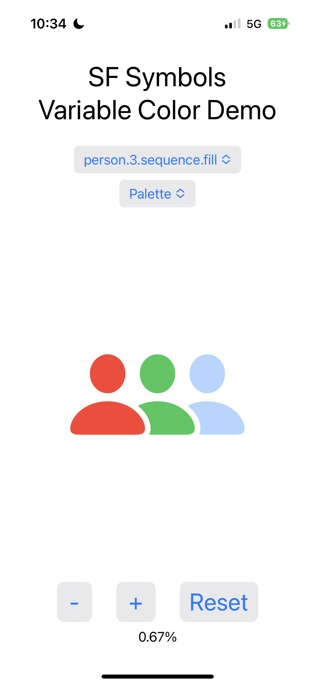

# SFSymbolsDemo

This demonstrates a SwiftUI app that uses SF Symbols with variable colors.
In the screenshot below:

- The first picker is for selecting an SF Symbol.
  Only a subset of the icons that support variable color are included.
- The second picker is for selecting a rendering mode.
  Select "Palette" for the most colors.
- The buttons at the bottom change the percentage value
  associated with the icon which affects
  the parts of the icon that are filled in.

